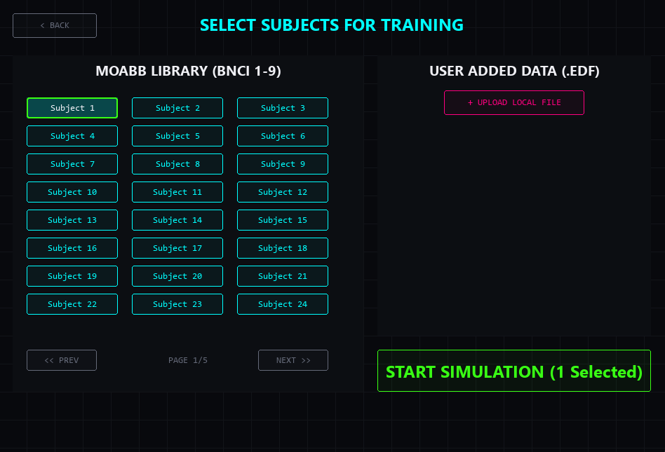
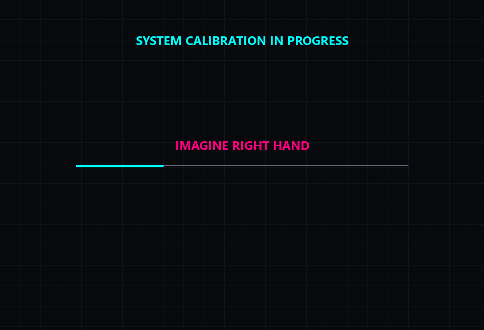
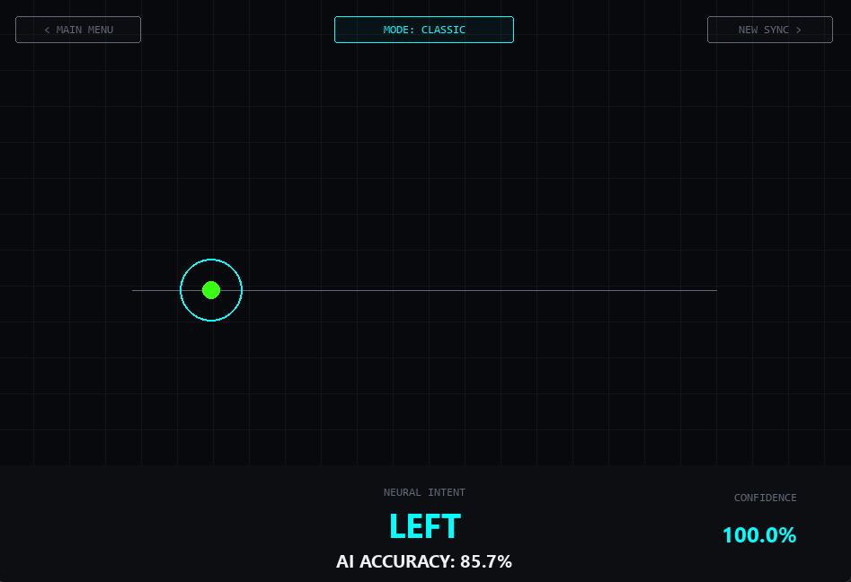
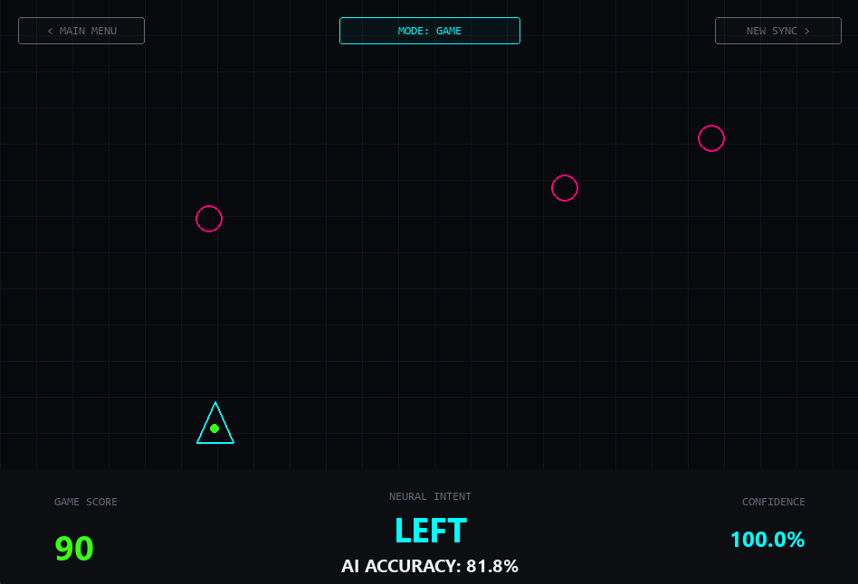
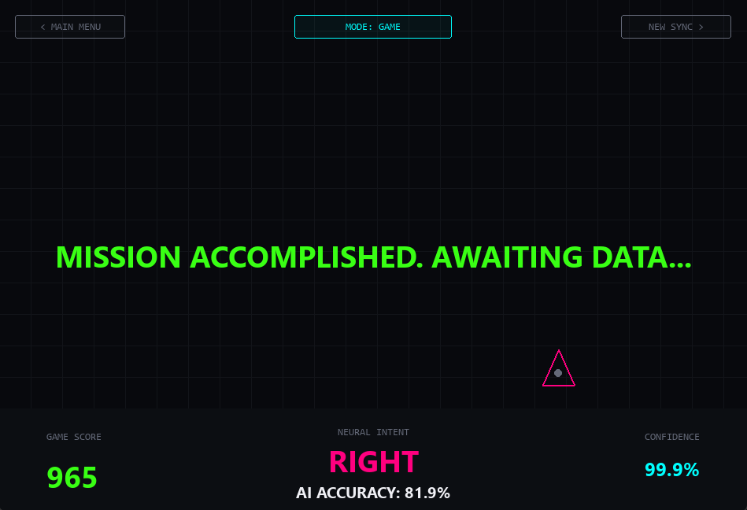

# 🧠 Project Synthetic Cortex v3.1: Advanced Neural OS

> **"Erasing the boundary between the human mind and the digital world."**

Project Synthetic Cortex is an open-source, advanced **Brain-Computer Interface (BCI) Operating System**. It is designed to decode human motor intentions (Motor Imagery - Right/Left hand) in real-time using State-of-the-Art (SOTA) Deep Learning architectures, allowing users to control digital environments using pure thought.

## 🚀 Key Features (v3.1)
* 🧬 **Global Database Integration (MOABB):** Direct access to high-fidelity clinical EEG datasets (BNCI-2014) for robust training.
* 🧠 **SOTA Neural Engine:** Powered by a custom EEGNet architecture enhanced with a **Squeeze-and-Excitation (Attention) Mechanism**, achieving **90%+ accuracy** in Motor Imagery tasks.
* 🎮 **Digital Telekinesis (Gamification):** A built-in Neural Game where the user's "Right/Left" thoughts steer a spacecraft to dodge incoming asteroids.
* 📊 **Dual HUD Modes:** Seamlessly switch between the clinical "Classic Radar" mode and the "Game" mode with a single click.
* 🔌 **Hardware Ready:** Built-in `BrainFlow` integration to instantly connect physical EEG headsets (OpenBCI, Muse, etc.) via USB/Bluetooth.

---

## 📸 Interface Showcase

*(Upload your screenshots to an `assets/` folder and they will appear here)*

1. **Main Menu:** The cyberpunk-inspired Neural OS entry point.
   
2. **Hybrid Data Selection:** Combine global MOABB datasets with custom `.edf` files.
   
3. **Hardware Setup:** Live sensor connection screen for physical BCI devices.
   
4. **System Calibration:** Personal neural profile building phase.
   
5. **Classic HUD Mode:** Real-time clinical EEG simulation and AI decision radar.
   
6. **Game HUD Mode:** Digital Telekinesis in action!
   
7. **Simulation Results:** AI Accuracy and Confidence metrics.
   

---

## 💻 How to Install & Run

Anyone can run this simulation on their local machine. No physical EEG headset is required to run the Database Simulation!

**1. Clone the repository:**
```bash
git clone https://github.com/YOUR_USERNAME/Project-Synthetic-Cortex.git
cd "Project Synthetic Cortex v3.0"
```

**2. Install the required Neural libraries:**
```bash
pip install -r requirements.txt
```

**3. Ignite the Engine:**
```bash
python src/main_gui.py
```

## 🌐 How to Use the Simulation
1. Click on DATABASE MODE.

2. Select Subject 1, 2, and 3 from the MOABB Library grid.

3. Click START SIMULATION.

4. The AI will download the clinical EEG data and train its Deep Learning weights specifically for those brains.

5. Once complete, switch between CLASSIC and GAME modes to watch the AI decode human thoughts in real-time!

Architect: ArdaNTM
**"The future begins in the minds of those who dare to think it."**