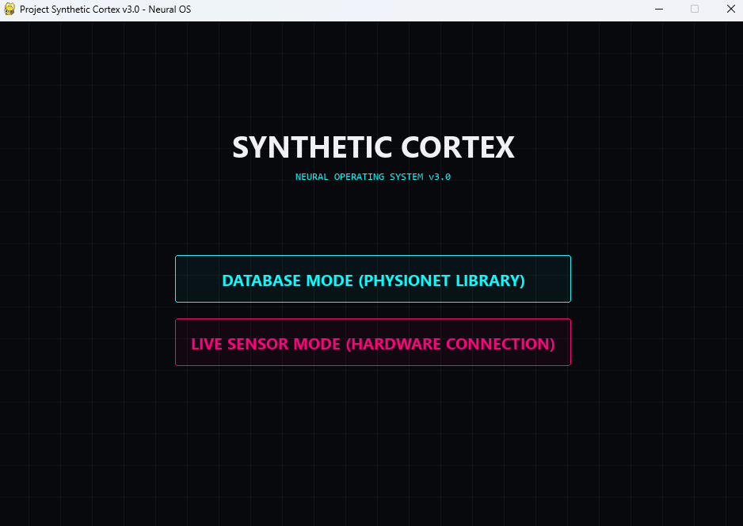
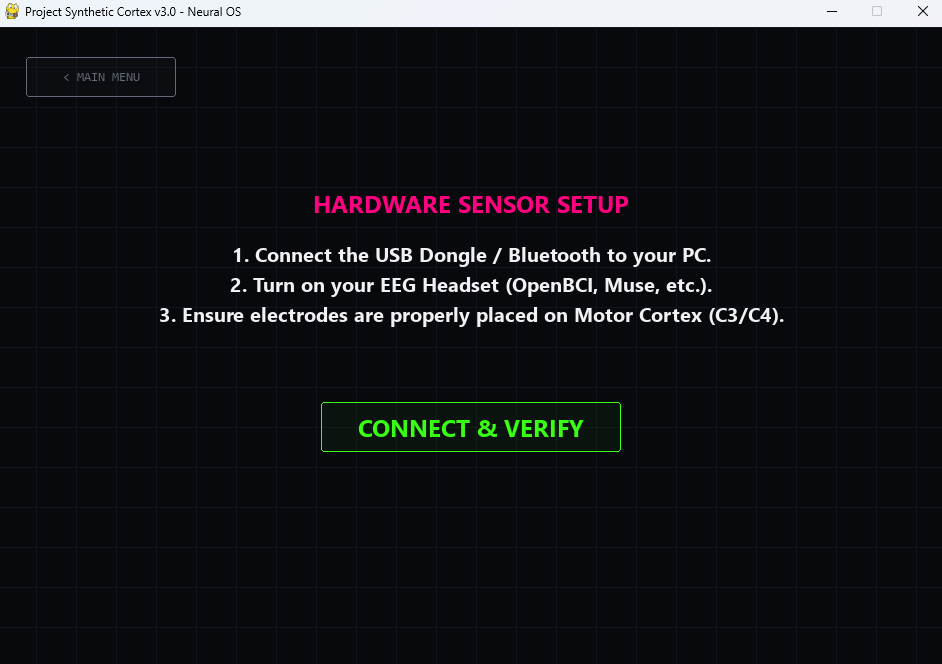
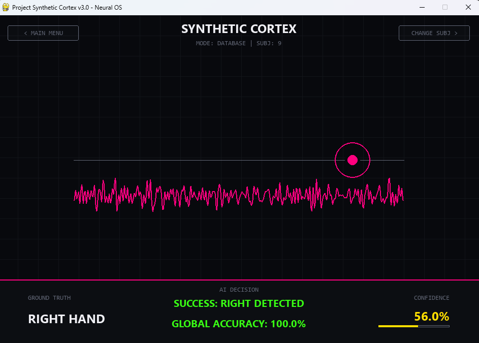

# 🧠 Project Synthetic Cortex

> **"Erasing the boundary between the human mind and the digital world."**

Project Synthetic Cortex is a **Brain-Computer Interface (BCI)** initiative aimed at decoding motor intentions (Motor Imagery) in the human brain in real-time to control digital and physical systems.

## 🚀 Vision
This project is not just a repository of code; it is the foundation of a future where paralyzed individuals can control robotic limbs, and humans form a symbiotic bond with artificial intelligence. Our ultimate goal is to translate neural signals into machine language with the lowest possible latency and the highest accuracy.

## 📸 Interface Showcase

Here is a glimpse of the **Neural Operating System (v3.0)** featuring real-time EEG decoding, hardware setup, and dynamic calibration.

*Modern, cyberpunk-inspired main menu with Database and Live Hardware modes.*

*Real-time hardware verification using the BrainFlow library.*

*Live simulation HUD displaying ground truth, AI decision, confidence bar, and real-time EEG signals.*

## 🛠 Current State: Phase 1 (Neural Motor Decoding)
The current release (v2.0) is a working Proof of Concept (PoC) that processes raw EEG signals from the scalp to distinguish between right-hand and left-hand motor imagery.

### Key Features:
- **Real-time HUD:** A futuristic, cyberpunk-inspired graphical interface for real-time neural activity tracking.
- **Personal Synchronization (Calibration):** An adaptive machine learning engine that calibrates itself in seconds based on the user's unique "brain fingerprint".
- **Advanced Signal Processing:** Utilizes an 8-30 Hz (Mu/Beta) bandpass filter alongside Common Spatial Pattern (CSP) for spatial filtering.
- **Accuracy:** Achieves 70%+ accuracy with personal calibration on the PhysioNet EEG Motor Movement/Imagery Dataset.

## 📊 Tech Stack
- **Language:** Python
- **Signal Processing:** MNE-Python
- **Machine Learning:** Scikit-learn (SVM + CSP Pipeline)
- **Visualization:** Pygame (Real-time HUD)

## 🗺 Roadmap
Project Synthetic Cortex is designed with a continuously evolving, modular architecture:
- [x] **Phase 1:** Core Motor Imagery Processing & GUI.
- [ ] **Phase 2:** Deep Learning Integration - Achieving 90%+ accuracy using the EEGNet architecture.
- [ ] **Phase 3:** Neural Gamification - Developing mind-controlled simulations and mini-games.
- [ ] **Phase 4:** Hardware Integration - Real-world robotic arm and drone control.

## 🤝 Contributing
If you want to be a part of this vision and lay a stepping stone for the future of neurotechnology, all forms of contributions (pull requests, bug reports, feature ideas) are highly welcome.

---
**Developer:** ArdaNTM
*"The future begins in the minds of those who dare to think it."*